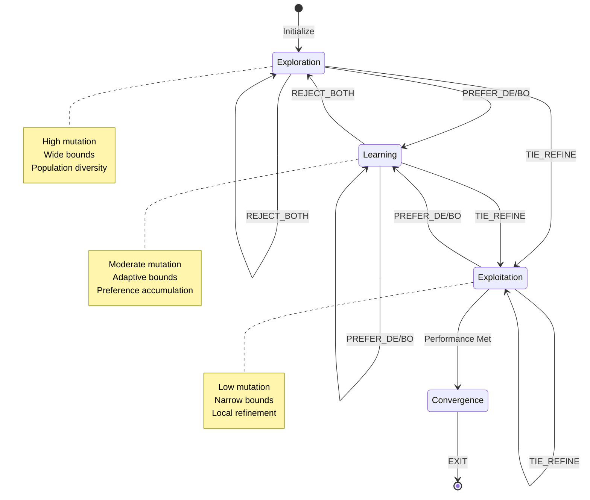

# Human Feedback Taxonomy in Mixed HIL Optimization

## Abstract

This document formally specifies the four-way human feedback mechanism that enables adaptive bi-directional optimization guidance in the Mixed HIL framework.

---

## Feedback Action Space

The human operator provides feedback from the discrete action space:

**ℱ = {PREFER_DE, PREFER_BO, TIE_REFINE, REJECT_BOTH, EXIT}**

Each action triggers distinct algorithmic responses in both optimizers.

---

## Formal Specification of Feedback Actions

### Action 1: PREFER_DE (Preference for Differential Evolution)

**Semantic Meaning:** The DE candidate demonstrates superior performance characteristics

**Algorithmic Response:**

```
Algorithm: PREFER_DE Feedback Handler
─────────────────────────────────────────────────────────────────────
Input:  θ_DE, θ_BO - Current candidates
        J_DE, J_BO - Objective values
        g_DE, g_BO - Constraint violations
        w - Preference weights
        
State Updates:
─────────────────────────────────────────────────────────────────────

1:  // === PREFERENCE LEARNING ===
2:  gap ← (θ_BO - θ_DE) / span              ▷ Normalized difference
3:  w_new ← w + α · ((θ_DE - bounds_min)/span - w)
4:  θ_anchor ← bounds_min + w_new ⊙ span
5:  
6:  // === DE UPDATES ===
7:  F_DE ← F₀                                ▷ Reset mutation to baseline
8:  DE.InjectCandidate(θ_anchor)            ▷ Single injection
9:  
10: // === BO UPDATES ===
11: if g_DE ≤ 0 then                         ▷ Only if feasible
12:     Δ ← |J_BO - J_DE|
13:     J_pseudo ← J_DE - β · Δ              ▷ β = 0.2
14:     BO.AddObservation(θ_DE, J_pseudo, g_DE)
15: end if
16: 
17: // === INTERPRETATION ===
18: // DE's search region is validated
19: // BO is nudged toward DE's solution
20: // Single anchor injection: moderate influence
```

**Information Flow:**
```
Human → Preference Model → Anchor → DE Population
                         ↓
                   BO Surrogate (synthetic cost)
```

---

### Action 2: PREFER_BO (Preference for Bayesian Optimization)

**Semantic Meaning:** The BO candidate demonstrates superior performance characteristics

**Algorithmic Response:**

```
Algorithm: PREFER_BO Feedback Handler
─────────────────────────────────────────────────────────────────────
Input:  θ_DE, θ_BO - Current candidates
        J_DE, J_BO - Objective values
        g_DE, g_BO - Constraint violations
        w - Preference weights
        
State Updates:
─────────────────────────────────────────────────────────────────────

1:  // === PREFERENCE LEARNING ===
2:  gap ← (θ_DE - θ_BO) / span
3:  w_new ← w + α · ((θ_BO - bounds_min)/span - w)
4:  θ_anchor ← bounds_min + w_new ⊙ span
5:  
6:  // === DE UPDATES (STRONGER INFLUENCE) ===
7:  F_DE ← F₀                                ▷ Reset mutation
8:  DE.InjectCandidate(θ_BO)                ▷ First injection: BO's solution
9:  DE.InjectCandidate(θ_anchor)            ▷ Second injection: anchor
10: 
11: // === BO UPDATES ===
12: if g_BO ≤ 0 then
13:     Δ ← |J_DE - J_BO|
14:     J_pseudo ← J_BO - β · Δ
15:     BO.AddObservation(θ_BO, J_pseudo, g_BO)
16: end if
17: 
18: // === INTERPRETATION ===
19: // BO's search region is validated
20: // DE receives DOUBLE injection (BO solution + anchor)
21: // Stronger correction: assumes DE was searching suboptimally
```

**Asymmetry Rationale:**
- When BO is preferred, DE receives **two injections** vs. one for PREFER_DE
- Justification: DE is population-based and more resistant to single-point guidance
- BO is already probabilistically exploring; needs less correction

---

### Action 3: TIE_REFINE (Convergence Signal)

**Semantic Meaning:** Both candidates show comparable quality; intensify local search

**Algorithmic Response:**

```
Algorithm: TIE_REFINE Feedback Handler
─────────────────────────────────────────────────────────────────────
Input:  θ_DE, θ_BO - Current candidates
        bounds_DE, bounds_BO - Current adaptive bounds
        
State Updates:
─────────────────────────────────────────────────────────────────────

1:  // === COMPUTE CONSENSUS POINT ===
2:  θ_consensus ← (θ_DE + θ_BO) / 2
3:  
4:  // === REFINE DE SEARCH SPACE ===
5:  range_DE ← bounds_DE_max - bounds_DE_min
6:  range_DE_new ← 0.5 · range_DE            ▷ Shrink by 50%
7:  
8:  bounds_DE_min ← θ_consensus - range_DE_new/2
9:  bounds_DE_max ← θ_consensus + range_DE_new/2
10: 
11: // Clamp to global bounds
12: bounds_DE_min ← MAX(bounds_DE_min, global_bounds_min)
13: bounds_DE_max ← MIN(bounds_DE_max, global_bounds_max)
14: 
15: F_DE ← 0.8 · F_DE                        ▷ Reduce mutation by 20%
16: P_DE ← InitializePopulation(bounds_DE_new)
17: P_DE[0] ← θ_consensus                    ▷ Seed with consensus
18: 
19: // === REFINE BO SEARCH SPACE ===
20: range_BO ← bounds_BO_max - bounds_BO_min
21: range_BO_new ← 0.5 · range_BO
22: 
23: bounds_BO_min ← θ_consensus - range_BO_new/2
24: bounds_BO_max ← θ_consensus + range_BO_new/2
25: 
26: bounds_BO_min ← MAX(bounds_BO_min, global_bounds_min)
27: bounds_BO_max ← MIN(bounds_BO_max, global_bounds_max)
28: 
29: // BO keeps GP history, only bounds change
30: 
31: // === INTERPRETATION ===
32: // Transition from exploration to exploitation
33: // Both optimizers focus on local neighborhood of consensus
34: // DE restarts population; BO retains knowledge
```

**Geometric Interpretation:**
```
Before TIE:                After TIE:
  
[--------DE--------]       [--DE--]
[--------BO--------]       [--BO--]
                               ↓
                           θ_consensus
```

---

### Action 4: REJECT_BOTH (Exploration Signal)

**Semantic Meaning:** Neither candidate is satisfactory; expand search to unexplored regions

**Algorithmic Response:**

```
Algorithm: REJECT_BOTH Feedback Handler
─────────────────────────────────────────────────────────────────────
Input:  bounds_DE, bounds_BO - Current adaptive bounds
        
State Updates:
─────────────────────────────────────────────────────────────────────

1:  // === EXPAND DE SEARCH SPACE ===
2:  center_DE ← (bounds_DE_min + bounds_DE_max) / 2
3:  range_DE ← bounds_DE_max - bounds_DE_min
4:  range_DE_new ← 1.5 · range_DE            ▷ Expand by 50%
5:  
6:  bounds_DE_min ← center_DE - range_DE_new/2
7:  bounds_DE_max ← center_DE + range_DE_new/2
8:  
9:  // Clamp to global bounds
10: bounds_DE_min ← MAX(bounds_DE_min, global_bounds_min)
11: bounds_DE_max ← MIN(bounds_DE_max, global_bounds_max)
12: 
13: // Check if already at global bounds
14: if bounds_DE ≈ global_bounds then
15:     // Diversification restart: already maximally expanded
16:     F_DE ← MIN(1.2 · F_DE, 1.0)          ▷ Increase mutation
17:     P_DE ← InitializePopulation(global_bounds)
18: else
19:     // Normal expansion
20:     F_DE ← MIN(1.2 · F_DE, 1.0)
21:     P_DE ← InitializePopulation(bounds_DE_new)
22: end if
23: 
24: // === EXPAND BO SEARCH SPACE ===
25: center_BO ← (bounds_BO_min + bounds_BO_max) / 2
26: range_BO ← bounds_BO_max - bounds_BO_min
27: range_BO_new ← 1.5 · range_BO
28: 
29: bounds_BO_min ← center_BO - range_BO_new/2
30: bounds_BO_max ← center_BO + range_BO_new/2
31: 
32: bounds_BO_min ← MAX(bounds_BO_min, global_bounds_min)
33: bounds_BO_max ← MIN(bounds_BO_max, global_bounds_max)
34: 
35: // BO retains GP with "bad region" knowledge
36: 
37: // === INTERPRETATION ===
38: // Escape local optima or poor search regions
39: // DE restarts with higher mutation (more exploratory)
40: // BO keeps negative examples to avoid rejected regions
```

**Geometric Interpretation:**
```
Before REJECT:             After REJECT:

    [--DE--]           [------DE------]
    [--BO--]           [------BO------]
```

---

### Action 5: EXIT (Termination)

**Semantic Meaning:** Human satisfaction with current results

**Algorithmic Response:**

```
Algorithm: EXIT Feedback Handler
─────────────────────────────────────────────────────────────────────

1:  θ_best ← ExtractBestFeasible({θ_DE, θ_BO, DE.population, BO.history})
2:  SaveOptimizationHistory()
3:  return θ_best
```

---

## Automatic Termination Criteria

In addition to human-triggered EXIT, the system implements automatic termination:

```
Algorithm: Auto-Termination Check
─────────────────────────────────────────────────────────────────────
Input:  θ_DE, θ_BO - Current candidates
        metrics_DE, metrics_BO - Performance metrics
        g_DE, g_BO - Constraint violations
        
Criteria:
─────────────────────────────────────────────────────────────────────

1:  // === PERFORMANCE TARGETS ===
2:  target_met(metrics) ← 
3:      (metrics.overshoot ≤ overshoot_max) ∧
4:      (0 < metrics.rise_time ≤ rise_time_max) ∧
5:      (0 < metrics.settling_time ≤ settling_time_max)
6:  
7:  // === CHECK DE ===
8:  if target_met(metrics_DE) ∧ g_DE ≤ 0 then
9:      return θ_DE, "auto_terminate_de"
10: end if
11: 
12: // === CHECK BO ===
13: if target_met(metrics_BO) ∧ g_BO ≤ 0 then
14:     return θ_BO, "auto_terminate_bo"
15: end if
16: 
17: continue_optimization
```

---

## Feedback Statistics and Analysis

### Information Gain per Feedback Type

| Feedback | Weight Update | Anchor Injection | Bounds Modification | Mutation Change |
|----------|---------------|------------------|---------------------|-----------------|
| PREFER_DE | ✓ (toward DE) | 1× anchor | None | Reset to F₀ |
| PREFER_BO | ✓ (toward BO) | 2× (BO + anchor) | None | Reset to F₀ |
| TIE_REFINE | None | None | Shrink 50% | ×0.8 |
| REJECT_BOTH | None | None | Expand 50% | ×1.2 (cap 1.0) |

### Expected Feedback Distribution (Empirical)

Based on typical PID tuning sessions:
- **PREFER_DE/BO**: 50-60% (learning phase)
- **TIE_REFINE**: 20-30% (convergence phase)
- **REJECT_BOTH**: 10-20% (exploration/escape)
- **EXIT**: 1 (final iteration)

---

## State Transition Diagram



---

## Mathematical Properties

### Property 1: Preference Convergence

**Theorem:** Under consistent human preferences, the weight vector w converges to a fixed point.

**Proof sketch:** 
- Let θ* be the consistently preferred region
- w^(t+1) = w^(t) + α(θ̂* - w^(t)) is a contraction mapping
- Fixed point: w* = θ̂* (normalized preferred region)

### Property 2: Bounds Monotonicity

**Invariant:** Adaptive bounds always satisfy:
```
bounds_adaptive ⊆ global_bounds
```

**Enforcement:** Every bounds modification includes global clamping (Alg 8, lines 10-12)

### Property 3: Population Feasibility Preservation

**Invariant (DE):** After candidate injection with `protect_best=true`:
```
∃i : (P[i], J[i], g[i]) = best_before_injection
```

**Rationale:** Never lose the best feasible solution found so far

---

## Implementation Considerations

### Feedback Latency

Human decision time varies:
- Quick decisions (<5s): High confidence
- Slow decisions (>20s): Uncertain preferences
- Could weight preference updates by decision speed (future work)

### Feedback Consistency Validation

Track preference reversals:
```
if PREFER_DE at iteration i and PREFER_BO at i+1:
    if ||θ_DE^(i) - θ_BO^(i+1)|| < ε then
        FLAG: Inconsistent preference
```

### Undo Mechanism (Not Implemented)

Could allow operator to reverse last feedback:
```
UndoLastFeedback():
    Restore: w, bounds, populations, GP from checkpoint
```

---

## Comparative Analysis with Alternative Feedback Schemes

| Scheme | Actions | Learning | Adaptation | Complexity |
|--------|---------|----------|------------|------------|
| **Binary (Accept/Reject)** | 2 | Limited | Fixed bounds | Low |
| **Pairwise Preference** | 2 | Yes | No bounds control | Medium |
| **Mixed HIL (Ours)** | 4 | Yes | Dynamic bounds | High |
| **Continuous Rating** | ∞ | Yes | Requires calibration | Very High |

**Trade-off:** Mixed HIL balances expressiveness (4 actions) with cognitive load and implementation simplicity.

---

## Conclusion

The four-way feedback taxonomy enables:

1. **Directional Guidance** (PREFER_DE/BO): Steer search toward promising regions
2. **Exploitation Control** (TIE_REFINE): Signal convergence, intensify local search
3. **Exploration Recovery** (REJECT_BOTH): Escape poor regions, expand search
4. **Graceful Termination** (EXIT + Auto): Human or criteria-based stopping

This design provides a rich, yet cognitively manageable interface for human expertise integration in optimization.

---

*This taxonomy provides the formal basis for reproducing and extending the Mixed HIL feedback mechanism.*
